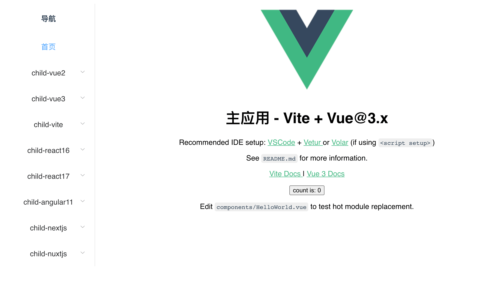

# 简介
micro-app-demo 作为 [micro-app](https://github.com/micro-zoe/micro-app) 的案例仓库，举例了 `react`, `vue`, `angular`, `nextjs`, `nuxtjs`, `vite` 如何作为主应用和子应用接入微前端，并在尽可能改动少量的代码的情况下做出尽可能完善的功能。

micro-app-demo中所有项目都是使用官方脚手架创建的，它们足够精简，你完全可以将其中的demo作为基础进一步开发自己的项目。

# 目录结构
```
.
├── child_apps
│   ├── angular11        // 子应用 angular11 (history路由)
│   ├── nextjs11         // 子应用 nextjs11 (history路由)
│   ├── nuxtjs2          // 子应用 nuxtjs2 (history路由) 
│   ├── react16          // 子应用 react16 (history路由)
│   ├── react17          // 子应用 react17 (hash路由)
│   ├── sidebar          // 子应用 sidebar，公共侧边栏
│   ├── vite-vue3        // 子应用 vite (hash路由)
│   ├── vue2             // 子应用 vue2 (history路由)
│   └── vue3             // 子应用 vue3 (history路由)
├── main_apps
│   ├── angular11        // 主应用 angular11 (history路由)
│   ├── nextjs11         // 主应用 nextjs11 (history路由)
│   ├── nuxtjs2          // 主应用 nuxtjs2 (history路由)
│   ├── react16          // 主应用 react16 (history路由)
│   ├── react17          // 主应用 react17 (history路由)
│   ├── vite-vue3        // 主应用 vite (history路由)
│   ├── vue2             // 主应用 vue2 (history路由)
│   └── vue3             // 主应用 vue3 (history路由)
├── package.json
└── yarn.lock

19 directories, 5 files
```

# 开始

## 1、安装依赖

```bash
yarn bootstrap
```

如果失败，建议单独进入子目录执行`yarn`安装。


## 2、运行项目
各主应用都监听了3000端口，所以只能同时启动一个主应用，而子应用端口各不相同，可以同时启动。

**1、启动 react16 主应用**

```bash
yarn dev:main-react16
```

访问：`http://localhost:3000/main-react16`

此时分别运行 `main_apps/react16` 以及 `child_apps` 文件夹下的所有子应用。

**2、启动 react17 主应用**

```bash
yarn dev:main-react17
```

访问：`http://localhost:3000/main-react17`

此时分别运行 `main_apps/react17` 以及 `child_apps` 文件夹下的所有子应用。

**3、启动 vue2 主应用**

```bash
yarn dev:main-vue2
```

访问：`http://localhost:3000/main-vue2`

此时分别运行 `main_apps/vue2` 以及 `child_apps` 文件夹下的所有子应用。

线上地址：http://www.micro-zoe.com/main-vue2/

**4、启动 vue3 主应用**

```bash
yarn dev:main-vue3
```

访问：`http://localhost:3000/main-vue3`

此时分别运行 `main_apps/vue3` 以及 `child_apps` 文件夹下的所有子应用。


**5、启动 vite 主应用**

```bash
yarn dev:main-vite
```

访问：`http://localhost:3000/main-vite`

此时分别运行 `main_apps/vite-vue3` 以及 `child_apps` 文件夹下的所有子应用。


**6、启动 angular11 主应用**

```bash
yarn dev:main-angular11
```

访问：`http://localhost:3000/main-angular11`

此时分别运行 `main_apps/angular11` 以及 `child_apps` 文件夹下的所有子应用。


**7、启动 nextjs11 主应用**

```bash
yarn dev:main-nextjs11
```

访问：`http://localhost:3000/`

此时分别运行 `main_apps/nextjs11` 以及 `child_apps` 文件夹下的所有子应用。

线上地址：http://nextjs11.micro-zoe.com/

**8、启动 nuxtjs2 主应用**

```bash
yarn dev:main-nuxtjs2
```

访问：`http://localhost:3000/`

此时分别运行 `main_apps/nuxtjs2` 以及 `child_apps` 文件夹下的所有子应用。

线上地址：http://nuxtjs2.micro-zoe.com/

## 效果如下：



# 补充
- 1、如果你在安装依赖或启动项目时发生错误，可以尝试单独进入每个项目执行操作。
- 2、因为每个主应用都有侧边栏，一次次写太麻烦，所以将侧边栏单独分离出来作为子应用，也就是 `child-sidebar`，实际项目中不需要这样做，侧边栏一般放到主应用中。
- 3、因为nextjs和nuxtjs的基础路由是写死的，而child-nextjs11，child-nuxtjs2分别嵌入了多个主应用，每个主应用下的基础路由都不同，所以单独为每个主应用单独打包构建不同版本（main_apps/nextjs11, main_apps/nuxtjs2略微不同，它们单独绑定了端口，处于根目录，可以共用一个版本）。
